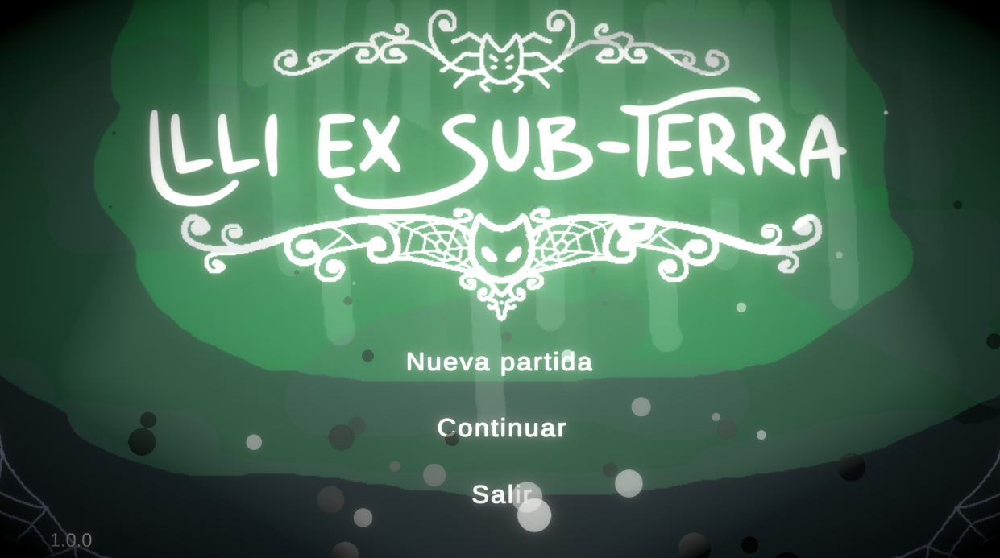
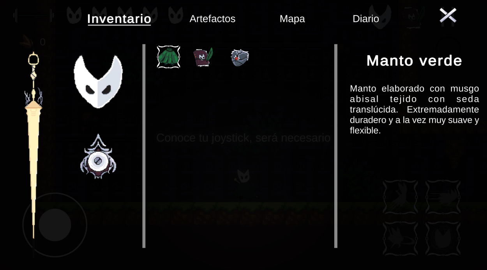
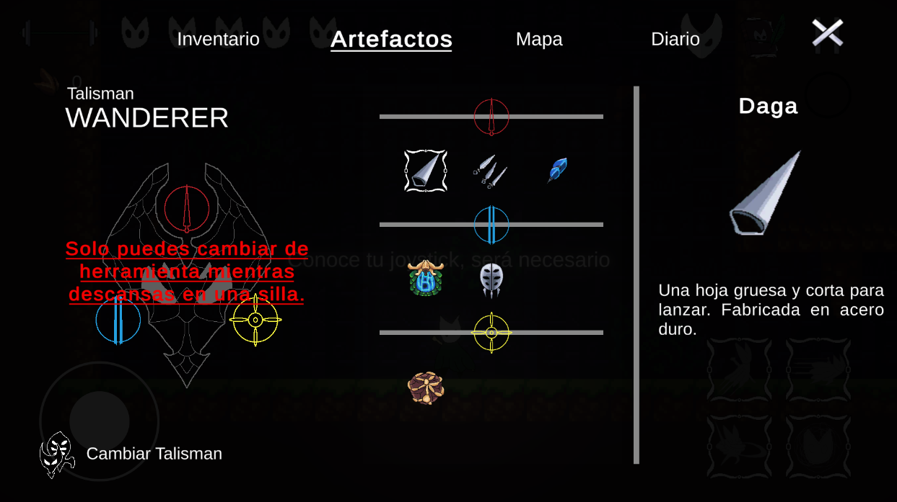
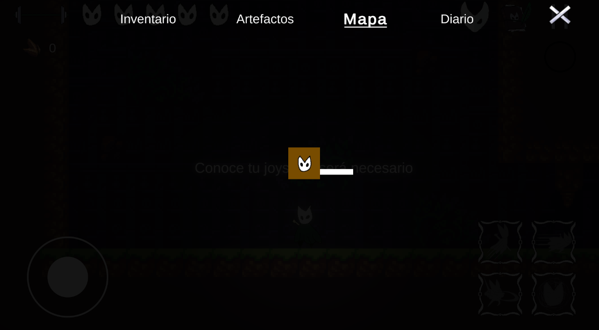
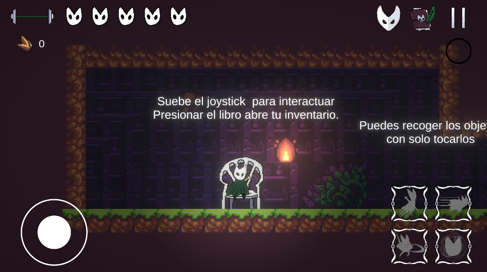
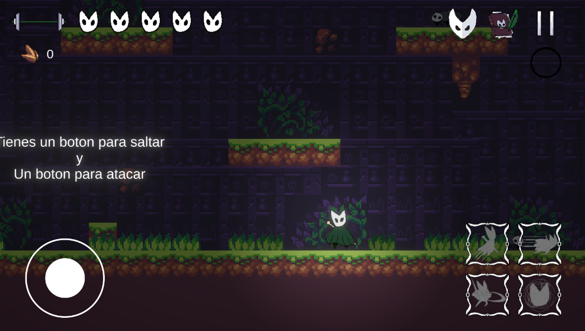
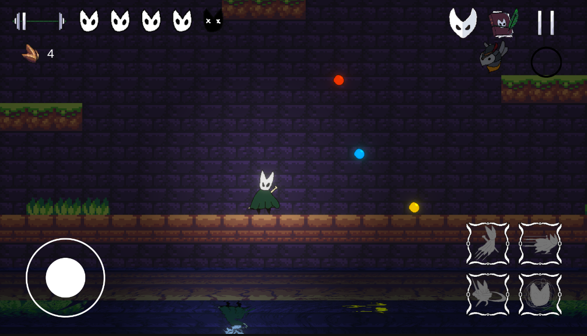
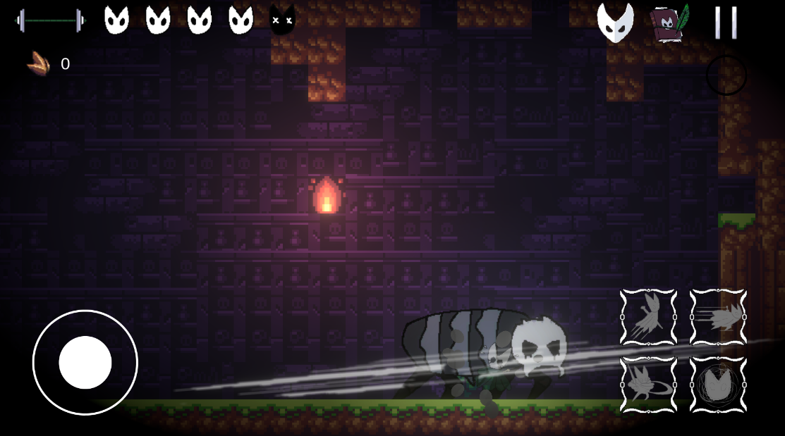

# Illi Ex Sub Terra

> *Una aventura Metroidvania inspirada en Hollow Knight*

## 🎮 Estado del Proyecto

**Actualmente en desarrollo** - Explorando nuevos conceptos y mecánicas. Posible retorno al desarrollo más adelante.

**Versión de Unity:** 6000.2.15f1

**Plataforma:** Móvil (Android) con soporte para mando

**Link de Descarga:** https://lgsusomg.itch.io/illi-ex-sub-terra

**Link de Descarga:** https://lgsusomg.itch.io/illi-ex-sub-terra

---

## 📖 Descripción

Illi Ex Sub Terra es un juego de acción y plataformas 2D donde exploras cavernas subterráneas, combates enemigos y desbloqueas nuevas habilidades. Domina mecánicas de movimiento como agarrar bordes, ataques pogo y habilidades basadas en seda para navegar entornos desafiantes.

---

## 🎯 Características

- **Sistema de Movimiento Fluido**: Salto de pared, agarre de bordes, dash y más
- **Mecánicas de Combate**: Ataques terrestres, combos aéreos y golpes pogo
- **Habilidades de Seda**: Curación, proyectiles y ataques de área usando recurso de seda
- **Pantallas de Carga Aleatorias**: Fondos dinámicos y animaciones de personaje
- **Sistema de Guardado**: Continúa tu aventura desde puntos de control
- **Elementos Aleatorios**: Fondos de menú randomizados para variedad
- **Controles Táctiles + Mando**: Juega como prefieras

---

## 🕹️ Controles

### **Controles Táctiles (Móvil)**
- **Joystick Virtual**: Mover izquierda/derecha
- **Botón Saltar**: Cerca de bordes para auto-agarrar
- **Mantener Saltar**: Saltar más alto
- **Botón Dash**: Ráfaga de movimiento rápido
- **Botón Atacar**: Ataque básico en tierra
- **Arriba + Atacar**: Corte hacia arriba (anti-aéreo)
- **Abajo + Atacar (en aire)**: Ataque pogo (rebota en enemigos/objetos)
- **Parry**: Mover Joystick Abajo

### **Controles con Mando**
- **Stick Analógico / D-Pad**: Mover
- **A / B**: Saltar
- **X / Y**: Atacar
- **R1 / RB**: Dash
- **Direccional + Habilidad de Seda**: Usar habilidades especiales

---

## 🖼️ Capturas de Pantalla
## Menú Principal

## Inventario

## Artefactos Equipables

## Mapa

## Descanzo/Checkpoint

## Zona con Enemigos

## Boss

---

## 🛠️ Aspectos Técnicos Destacados

- **Sistema de Carga**: Manager personalizado con animaciones aleatorias
- **Guardar/Cargar**: Datos persistentes del jugador con sistema de checkpoints
- **Animación**: Controlador de personaje basado en máquina de estados
- **UI/UX**: Fondos dinámicos y transiciones suaves
- **Controles Adaptativos**: Detección automática de táctil/mando
- **Optimización Móvil**: Rendimiento optimizado para dispositivos móviles

---

## 🚀 Planes Futuros (Tal vez)

- [ ] Biomas y áreas adicionales
- [ ] Más tipos de enemigos y jefes
- [ ] Árbol de habilidades extendido
- [ ] Modo speedrun con cronómetro
- [ ] Sistema de logros
- [ ] Nuevo juego+ con dificultad aumentada
- [ ] Soporte para más tipos de mandos

---

## 🐛 Problemas Conocidos

- Ocasionales glitches de colisión en bordes específicos
- La UI de seda puede no actualizarse inmediatamente después de usar
- La pantalla de carga puede persistir si falla el spawn del jugador
- Optimización en algunos dispositivos de gama baja

---

## 📝 Notas de Desarrollo

Empezó como un proyecto de aprendizaje para entender:
- Física 2D y tilemaps de Unity
- Patrones de diseño de máquina de estados
- Sistemas de guardar/cargar
- Diseño de flujo UI/UX
- Adaptación de controles para móvil
- Optimización de rendimiento

Actualmente explorando otros conceptos de juego, pero podría volver a expandir este proyecto.

---

## 📱 Requisitos del Sistema

### Android
- Versión mínima: Android 7.0 (API 24)
- RAM: 2GB mínimo, 4GB recomendado
- Almacenamiento: 200MB

### iOS
- Versión mínima: iOS 12.0
- Dispositivos compatibles: iPhone 6s o superior
- Almacenamiento: 200MB

---

**⭐ Si encontraste este proyecto interesante, ¡considera darle una estrella al repositorio!
